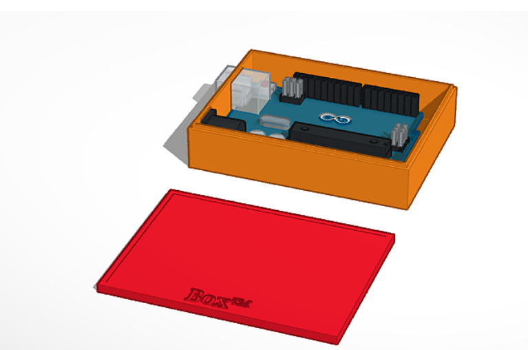
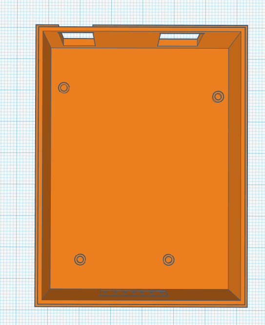
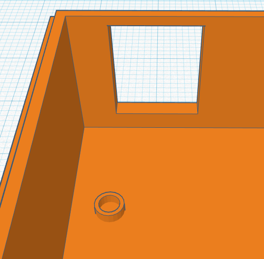
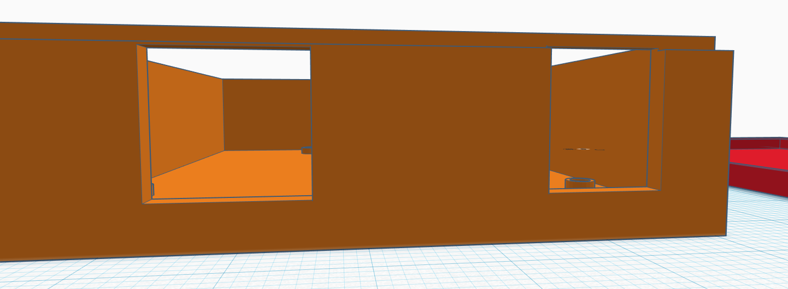
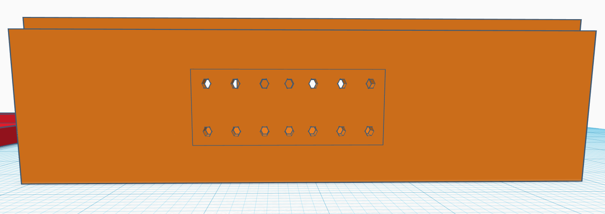
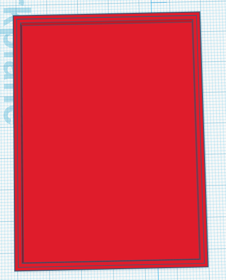
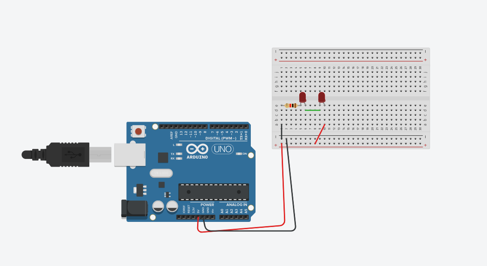
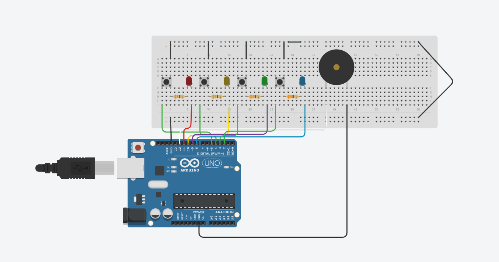

# Verkefni 5 - Simon Says

Fyrsta skrefið var að hanna box í Tinkercad. Þar bjó ég til opnann kassa sem passar utan um Arduino Uno tölvu án þess að halda henni fastri.

Síðan setti ég solid cylinders í botninn á kassanum þar sem götin á Arduino lenda og setti aðra Cylinders inn í þá og gerði þá holur.

Skrúfur fara inn í Arduino og festast í þessum cylinders og halda því tölvunni kyrri.

Einnig setti ég göt framan á kassann til þess að tengin úr tölvunni geta staðið aðeins út.

Einnig setti ég grill ("Heatsink") á afturendann á kassanum til þess að heitt loft kemst út úr honum.

Svo að lokum hannaði ég lok fyrir kassann sem passar nákvæmlega á.

Ég æfði mig svo í Tinkercad með rafrásir.

Hér er svo rafrásin sem ég notaði fyrir Simon Says úr Tinkercad.

